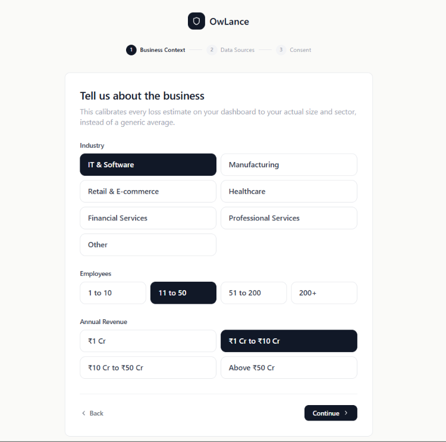
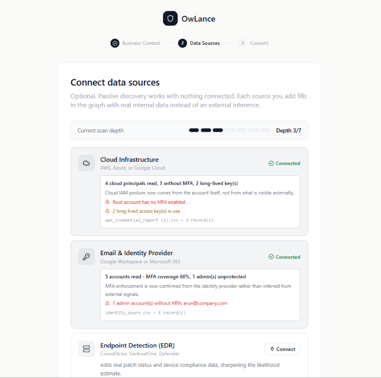
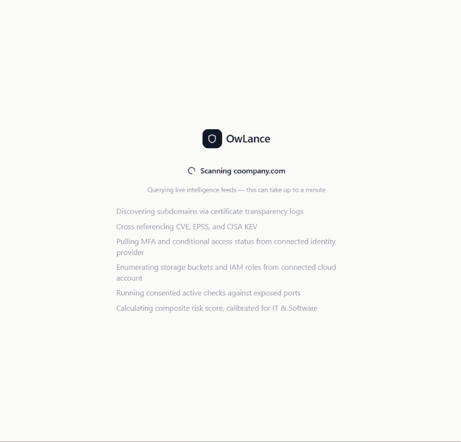
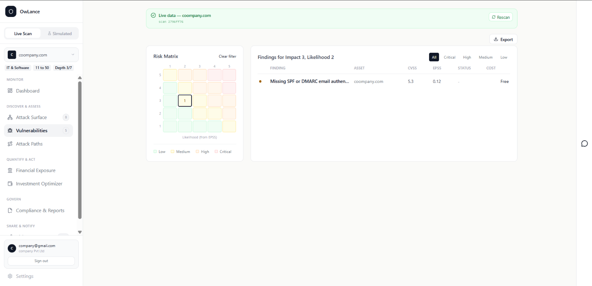
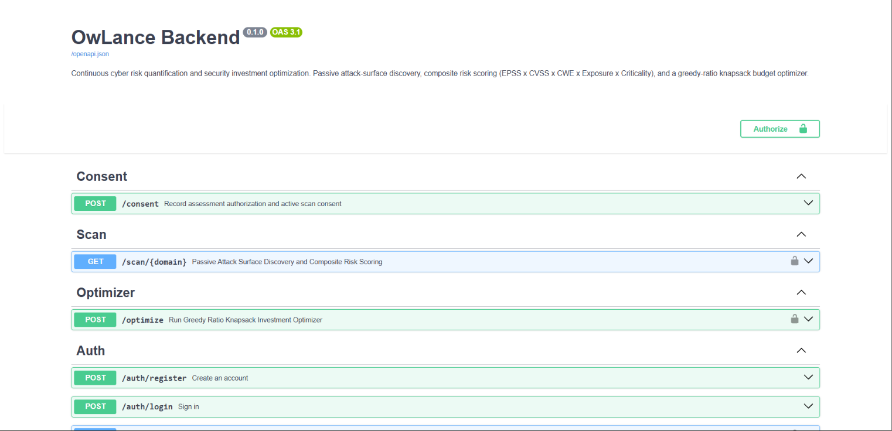

# RiskLens (OwLance)

**AI-Powered Continuous Cyber Risk Quantification and Investment Optimization Platform**
SIH26105 · AICTE · Theme: Blockchain & Cybersecurity

Most cyber risk tools tell a business "Low / Medium / High" — which tells a CISO
or a small-business owner nothing about how much money is actually at stake.
RiskLens gives budget-constrained organizations a transparent, auditable risk
score benchmarked against real breach data, translated directly into rupee
terms and a ranked, budget-aware action plan.

---

## Live Demo

- **Frontend:** `[your Vercel URL]`
- **Backend API docs:** `[your Render URL]/docs`

*(First load on the deployed backend may take 30–60 seconds to wake up on the
free tier — this is expected, not a bug.)*

---

## Walkthrough

### 1. Tell us about the business


Industry, employee count, and revenue band aren't decorative — this
calibrates every loss estimate on the dashboard to the business's actual
size and sector instead of a generic average.

### 2. Connect data sources (optional)


Passive discovery works with nothing connected. Each source added — cloud,
identity provider, EDR — fills in the risk graph with real internal data
instead of an external inference, visibly raising the **Depth** meter and
the platform's confidence in its own numbers.

### 3. Confirm scope and consent


Passive discovery (certificate logs, DNS, public breach data) runs
automatically — no authorization needed, since it only reads public
records. Active checks require explicit, logged consent before anything
touches the target's live systems. Every scan action is written to a
tamper-evident audit log.

### 4. Live scan in progress


Real-time status reflects exactly what's actually running — subdomain
discovery via CT logs, CVE/EPSS/KEV cross-referencing, MFA status pulled
from a connected identity provider, all calibrated for the business's
declared sector.

### 5. Dashboard


One score (0–900, credit-score scale), Expected Annual Loss, potential
savings, and assets monitored — all computed from the live scan, not
placeholder data. The Security Posture and Score Build-up charts show
exactly which categories (Identity, Network, Web App, Cloud, Email) are
driving the number.

### 6. Vulnerabilities


Every finding plotted on an Impact × Likelihood risk matrix, with EPSS
driving the likelihood axis. Each finding shows CVSS, EPSS, status, and
remediation cost — free fixes are labeled as such up front.

### 6b. Causal Risk Graph — Adaptive Depth (Simulated)


*Note: this view uses a simulated dataset ("Synthetic Org (demo)"), not the
live `coompany.com` scan above — shown honestly as such in the toggle.*

This is Attack-Path Collapse in its full form: Threat → Vulnerability →
Asset → Identity → Control Gap → Business Service → Financial Loss. On a
passive-only external scan this chain runs 2–4 hops; the moment an internal
identity or control data source connects, the *same graph* — not a new one —
extends through the Identity and Control Gap layers shown here. This is the
concrete proof behind the platform's "one adaptive engine, not two tiers"
design: there's no separate SME product and enterprise product, just one
causal graph that gets denser as more sources connect.

### 7. Investment Optimizer


The core differentiator: drag the budget slider and a greedy-ratio
knapsack algorithm live-recalculates which fixes to prioritize, always
surfacing free fixes first. Every recommendation shows its ROSI —
in this case a free fix returning **Infinite ROI**.

### 8. Risk Passport


A shareable, verifiable proof of security posture — for a bank, insurer,
or client — without exposing what's still open. Unlike tools that score a
company secretly, this passport is owned and shared by the business itself,
backed by a tamper-evident hash-chain, and deliverable straight to WhatsApp
so an owner doesn't need to log into a dashboard to see or share it.

### 9. API Documentation


Every number on the dashboard traces back to a real, testable endpoint —
consent logging, passive discovery + composite scoring, and the budget
optimizer are all live and independently verifiable via the interactive
Swagger UI.

---

## How it works

1. **Deterministic core, AI explains** — the scoring engine and optimizer are
   rule-based and fully auditable. No AI/LLM ever generates a risk number.
2. **Consent-first, passive-first** — active scanning only runs after
   explicit, logged authorization. Passive discovery is always on.
3. **Statistically honest** — financial exposure is always shown as a range
   (median / P90 / P99) with a confidence score, never a single fake-precise
   number.
4. **Benchmark-driven** — since small businesses can't manually calibrate
   FAIR-style probability inputs, financial modeling uses sector- and
   size-matched breach-cost benchmark data.
5. **One adaptive engine, not two tiers** — the same causal risk graph starts
   sparse (external-only) and fills in automatically as more data sources
   connect. There's no separate "SME version" and "enterprise version."

## Tech Stack

**Backend:** Python, FastAPI, PostgreSQL (SQLite fallback for local dev), SQLAlchemy
**Frontend:** React, Vite, Tailwind CSS
**Data sources:** crt.sh (Certificate Transparency), NVD, FIRST.org EPSS, CISA KEV

## Running locally

```powershell
git clone https://github.com/ramyakg6/SIH_CYBER.git
cd SIH_CYBER
Set-ExecutionPolicy -Scope Process -ExecutionPolicy Bypass
.\run.ps1
```

- Backend: http://127.0.0.1:8000/docs
- Frontend: http://localhost:5173

## Team

`[names here]`
