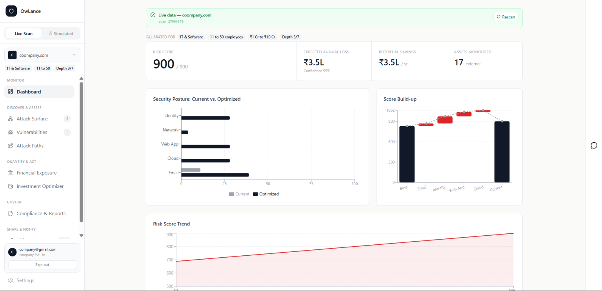
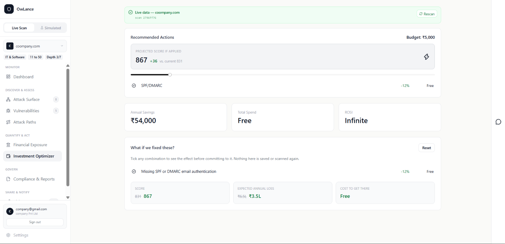
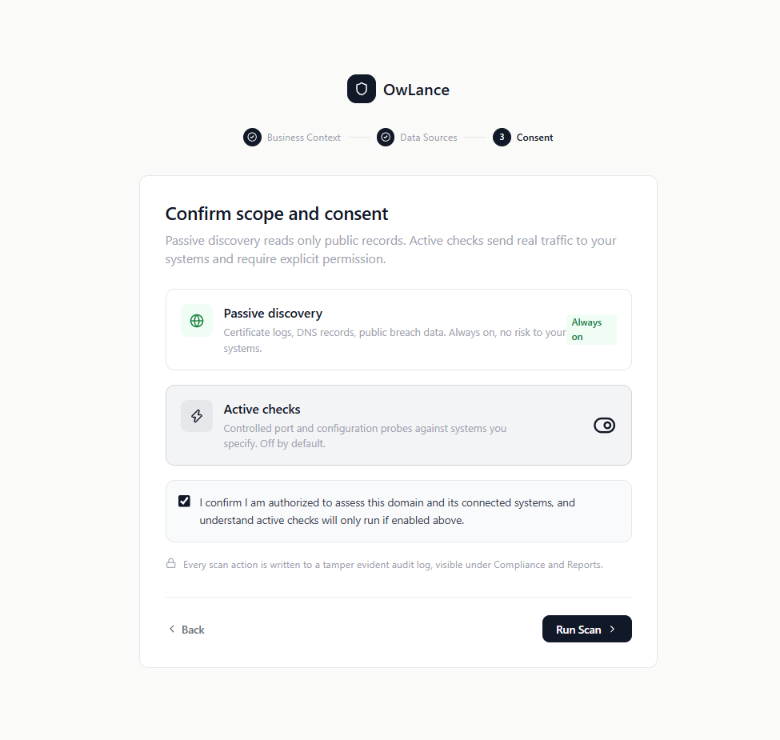
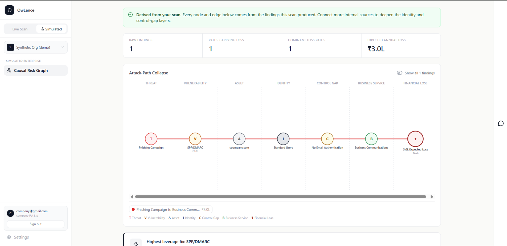

# RiskLens (OwLance)

**AI-Powered Continuous Cyber Risk Quantification and Investment Optimization Platform**
SIH26105 · AICTE · Theme: Blockchain & Cybersecurity


---

## 🔗 Live Demo

- **Frontend:** `[your Vercel URL]`
- **Backend API docs:** `[your Render URL]/docs`

*(First load on the deployed backend may take 30–60 seconds to wake up on the
free tier — this is expected, not a bug.)*

---

Most cyber risk tools tell a business "Low / Medium / High" — which tells a CISO
or a small-business owner nothing about how much money is actually at stake.
RiskLens gives budget-constrained organizations a transparent, auditable risk
score benchmarked against real breach data, translated directly into rupee
terms and a ranked, budget-aware action plan.

📖 **[See the full step-by-step walkthrough with screenshots →](docs/WALKTHROUGH.md)**

---

## What it looks like


*One score (0–900), Expected Annual Loss, and potential savings — all computed
live from a real scan, not placeholder data.*


*The core differentiator: drag the budget slider and a greedy-ratio knapsack
algorithm live-recalculates which fixes to prioritize, free fixes first.*


*Consent-first by design: active scanning only runs after explicit, logged
authorization — every scan action is written to a tamper-evident audit log.*


*Attack-Path Collapse: Threat → Vulnerability → Asset → Identity → Control Gap
→ Business Service → Financial Loss. The same graph starts sparse on an
external-only scan and densifies automatically as more data sources connect —
one adaptive engine, not a separate SME/enterprise tier.*

More screens — onboarding, live scanning, the vulnerability risk matrix, the
Risk Passport, and the API docs — are in the
**[full walkthrough](docs/WALKTHROUGH.md)**.

---

## 🚀 Features

- **Passive-first discovery** — subdomain and asset discovery via Certificate
  Transparency logs and DNS, with zero setup and no authorization required
- **Consent-first active scanning** — active checks run only after explicit,
  logged authorization; every scan action lands in a tamper-evident audit log
- **Benchmark-driven risk scoring** — a 0–900 composite score and Expected
  Annual Loss, calibrated to sector- and size-matched breach-cost benchmarks
  rather than hand-tuned FAIR inputs
- **Contextual vulnerability scoring** — CVSS + FIRST.org EPSS + CISA KEV,
  plotted on an Impact × Likelihood risk matrix
- **Causal risk graph** — an adaptive Threat → Vulnerability → Asset →
  Identity → Control Gap → Business Service → Financial Loss chain that
  densifies as more data sources connect
- **Investment optimizer** — greedy-ratio knapsack algorithm that
  live-recalculates which fixes to prioritize under a budget slider, always
  surfacing free fixes first, with ROSI per recommendation
- **Risk Passport** — a shareable, hash-chained proof of security posture,
  deliverable straight to WhatsApp
- **REST API** — full FastAPI backend with auto-generated Swagger/ReDoc docs

---

## How it works

1. **Deterministic core, AI explains** — the scoring engine and optimizer are
   rule-based and fully auditable. No AI/LLM ever generates a risk number.
2. **Consent-first, passive-first** — active scanning only runs after
   explicit, logged authorization. Passive discovery is always on.
3. **Statistically honest** — financial exposure is always shown as a range
   (median / P90 / P99) with a confidence score, never a single fake-precise
   number.
4. **Benchmark-driven** — since small businesses can't manually calibrate
   FAIR-style probability inputs, financial modeling uses sector- and
   size-matched breach-cost benchmark data.
5. **One adaptive engine, not two tiers** — the same causal risk graph starts
   sparse (external-only) and fills in automatically as more data sources
   connect. There's no separate "SME version" and "enterprise version."

---

## 📁 Project Structure

```
owlance/
├── src/                        # Frontend (React + Vite)
│   ├── App.jsx
│   ├── OwLance.jsx
│   ├── components/
│   ├── lib/
│   └── assets/
├── public/                     # Static assets
├── backend/                    # Backend (FastAPI + Python)
│   ├── app/
│   │   ├── main.py             # FastAPI application
│   │   ├── config.py
│   │   ├── db/                 # SQLAlchemy models + session
│   │   ├── routers/            # API routes (auth, scan, consent,
│   │   │                       #   optimizer, connectors, analytics, whatsapp)
│   │   ├── schemas/            # Pydantic schemas
│   │   └── services/           # Scoring, optimizer, scanners, threat intel
│   ├── tests/                  # Pytest test suite
│   ├── requirements.txt
│   └── .env.example
├── scripts/                    # Build/smoke-test helper scripts
├── docs/                       # This walkthrough + screenshots
├── run.ps1 / run.sh            # One-command local startup
├── vite.config.js
└── package.json
```

---

## 🛠️ Running locally

```powershell
git clone https://github.com/ramyakg6/SIH_OWLANCE.git
cd SIH_OWLANCE
Set-ExecutionPolicy -Scope Process -ExecutionPolicy Bypass
.\run.ps1
```

- Backend: http://127.0.0.1:8000/docs
- Frontend: http://localhost:5173

`run.ps1` / `run.sh` sets up the backend virtual environment, installs
frontend dependencies, and starts both servers. `backend/.env.example` seeds
a demo account (`demo@owlance.in` / `owlance2026`) on first boot so a fresh
clone is reachable with zero setup — the database falls back to SQLite
automatically if PostgreSQL isn't configured.

---

## 📊 API Endpoints

| Method | Endpoint | Description |
|--------|----------|-------------|
| POST | `/auth/register` | Create an account |
| POST | `/auth/login` | Sign in |
| GET | `/auth/me` | Current account |
| GET | `/audit` | Tamper-evident audit log |
| GET | `/audit/verify` | Verify audit log hash chain |
| POST | `/consent` | Log explicit scan authorization |
| GET | `/scan/{domain}` | Run a passive + active scan |
| GET | `/connectors` | List connected data sources for a scan |
| POST | `/connectors/{source_id}` | Connect a data source |
| DELETE | `/connectors/{source_id}` | Disconnect a data source |
| GET | `/analytics/{scan_id}` | Dashboard analytics for a scan |
| POST | `/optimize` | Run the budget-constrained investment optimizer |
| GET | `/whatsapp/status` | Risk Passport delivery status |
| POST | `/whatsapp/send-passport` | Send the Risk Passport via WhatsApp |

**Interactive API Documentation:**
- Swagger UI: `http://127.0.0.1:8000/docs`
- ReDoc: `http://127.0.0.1:8000/redoc`

---

## 🧪 Testing

```bash
cd backend
pytest -v
```

```bash
# Frontend build + smoke test + graph-layout check
npm run verify
```

---

## ⚙️ Configuration

Copy `backend/.env.example` to `backend/.env` and customize:

| Variable | Default | Description |
|----------|---------|-------------|
| `DATABASE_URL` | `sqlite:///./owlance.db` | Falls back to SQLite if Postgres is unreachable |
| `SECRET_KEY` | auto-generated | Set a fixed value for anything deployed |
| `SEED_DEMO_USER` | `true` | Seeds a demo account on first boot — set `false` before exposing publicly |
| `MAX_SCAN_TARGETS` | 25 | Caps hostnames processed per scan |
| `SCAN_DEADLINE_SECONDS` | 45.0 | Hard wall-clock deadline so the scan endpoint always returns |
| `CACHE_TTL_HOURS` | 24 | Threat-intel cache lifetime |

The root `.env.example` sets `VITE_API_URL` — point it at the deployed
backend URL when hosting the frontend separately (e.g. on Vercel).

---

## 🔧 Tech Stack

**Backend:** Python, FastAPI, PostgreSQL (SQLite fallback for local dev), SQLAlchemy, Pydantic
**Frontend:** React, Vite, Tailwind CSS
**Data sources:** crt.sh (Certificate Transparency), NVD, FIRST.org EPSS, CISA KEV

---

## Team

`[names here]`
