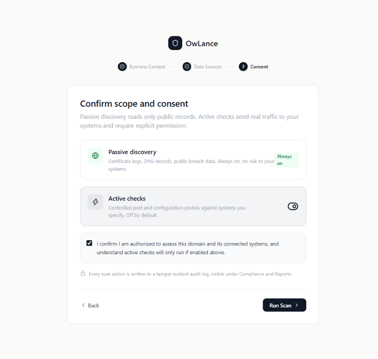
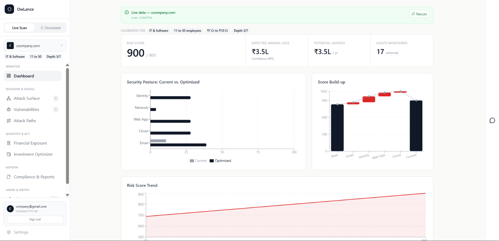
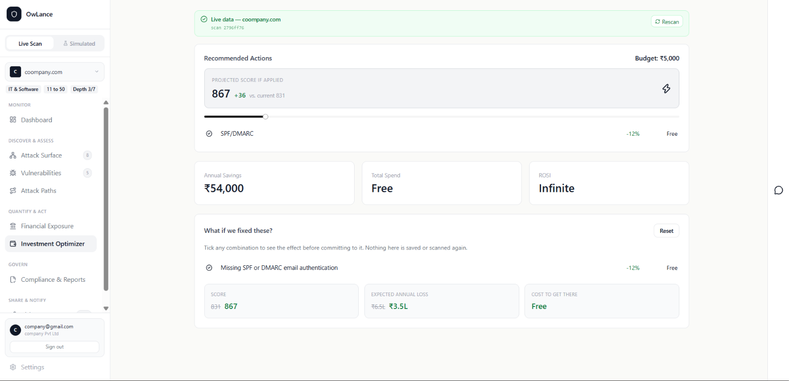
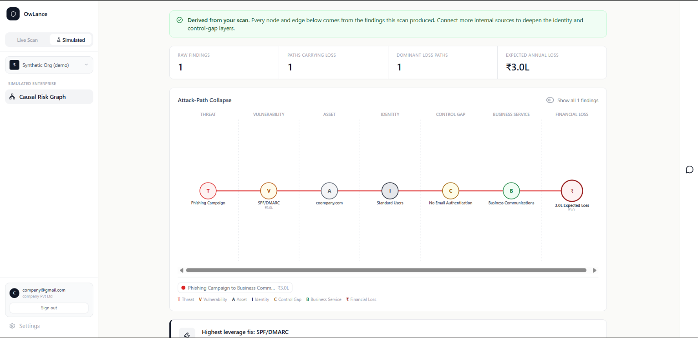
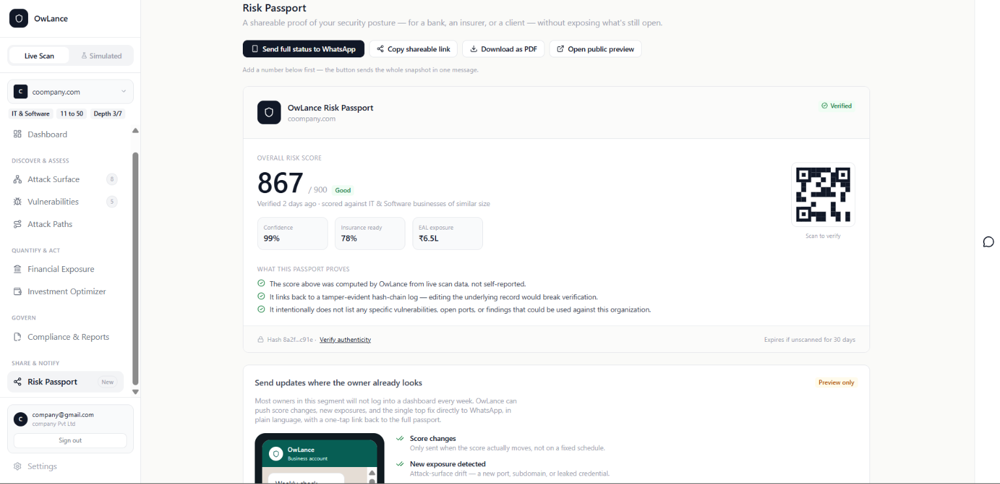

# OwLance

**AI-Powered Continuous Cyber Risk Quantification and Investment Optimization Platform**

Smart India Hackathon 2026 · **PS ID 26105** · AICTE (Cyber Security Cell) · Theme: Blockchain & Cybersecurity · Category: Software

---

## The problem

Most cyber risk tools tell a business "Low / Medium / High". That tells a CISO or a small-business owner nothing about how much money is actually at stake, or where a limited security budget should go first.

## Our solution

OwLance turns technical security findings into **rupee-denominated risk** and a **ranked, budget-constrained investment plan**. It keeps monitoring continuously, so the numbers update as the organization's exposure changes.

```
Continuous scan → Findings → Risk score (0–900) → Financial exposure (₹) → Optimized investment plan → Shareable Risk Passport
```

The business also gets a **Risk Passport**: a shareable, tamper-evident proof of its security posture that it can hand to a bank, insurer or client without exposing what is still open.

📖 **[See the full step-by-step walkthrough with screenshots →](docs/WALKTHROUGH.md)**

---

## How OwLance answers PS 26105

| PS 26105 asks for | What OwLance delivers | Where to see it |
|---|---|---|
| **Continuous** risk quantification | Scheduled rescans, drift detection and score-change alerts (see [Continuous monitoring](#continuous-monitoring)) | Dashboard, Rescan, WhatsApp alerts |
| Risk expressed in **financial terms** | 0–900 score plus Expected Annual Loss with median / P90 / P99 range and a confidence score | Dashboard, Financial Exposure |
| **Investment optimization** | Budget slider, greedy-ratio knapsack optimizer, ROSI per fix, free fixes first | Investment Optimizer |
| **AI-powered** | EPSS exploit-probability model drives likelihood; an LLM Risk Copilot explains results in plain English | Risk Matrix, Risk Copilot |
| **Blockchain** theme | Hash-chained, tamper-evident audit log and Risk Passport (see [Integrity layer](#integrity-layer-blockchain-style-hash-chain)) | Compliance & Reports, Risk Passport |

---

## What it looks like


*Consent-first by design: active scanning only runs after explicit, logged
authorization — every scan action is written to a tamper-evident audit log.*


*One score (0–900), Expected Annual Loss, and potential savings — all computed
live from a real scan, not placeholder data.*


*Drag the budget slider and a greedy-ratio knapsack algorithm live-recalculates
which fixes to prioritize, free fixes first.*


*Attack-Path Collapse: Threat → Vulnerability → Asset → Identity → Control Gap → Business Service → Financial Loss. The graph starts sparse on an external-only scan and fills in as more data sources connect.*

## 🛡️ The Risk Passport — why RiskLens is different


*Most tools score a company secretly, for the vendor's own dashboard. The Risk
Passport flips that: it's a shareable, verifiable proof of security posture —
owned and controlled by the business itself, backed by a tamper-evident
hash-chain, and deliverable straight to WhatsApp so an owner doesn't need to
log into a dashboard to prove their posture to a bank, insurer, or client.
This is the feature that turns a risk score into something the business can
actually *use* — not just look at.*

More screens — onboarding, live scanning, the vulnerability risk matrix, and
the API docs — are in the **[full walkthrough](docs/WALKTHROUGH.md)**.


---

## 🚀 Features

- **Consent-first active scanning:** active checks run only after explicit, logged authorization. Passive discovery is always on.
- **Risk Score:** a 0–900 composite score and Expected Annual Loss, calibrated to sector- and size-matched breach-cost benchmarks.
- **Risk Matrix:** every finding on an Impact × Likelihood grid, with EPSS driving the likelihood axis.
- **Causal risk graph and ROSI:** an adaptive Threat → Vulnerability → Asset → Identity → Control Gap → Business Service → Financial Loss chain.
- **Investment optimizer:** greedy-ratio knapsack that recalculates under a budget slider, free fixes first, with ROSI per recommendation.
- **Risk Copilot (AI):** plain-English chat so a non-technical owner can ask "what is our highest financial risk today?". It only explains numbers the deterministic engine already computed. It never generates a score or a finding.
- **Risk Passport:** shareable, hash-chained proof of posture with QR verification, PDF download, public preview and WhatsApp delivery.
- **Compliance & Reports:** findings mapped to NIST CSF, ISO 27001, CIS Controls, RBI Guidelines and SEBI CSCRF, backed by the audit log.
- **REST API:** FastAPI backend with auto-generated Swagger / ReDoc docs.

---

## Continuous monitoring

"Continuous" means OwLance does not produce a one-time report. It keeps the score current.

- **Passive discovery:** always on. Reads public records only (certificate transparency logs via crt.sh, DNS, public breach data).
- **Rescan schedule:** [FILL: e.g. every 24 hours / on demand / configurable].
- **Drift detection:** each scan is compared with the previous one. New subdomains, open ports or leaked credentials count as new exposure.
- **Alerts:** a WhatsApp message is sent **only when the score actually moves** or a new exposure appears, not on a fixed schedule. [FILL: threshold, e.g. score change of ±N points].
- **Trend:** the dashboard's Risk Score Trend chart shows how posture changes over time.
- **Connectors:** [FILL: list the connectors in backend/app/routers/connectors, e.g. cloud, email, identity]. More connected sources make the causal graph denser and the loss estimate tighter.

---

## How it works

1. **Deterministic core, AI explains** — the scoring engine and optimizer are
   rule-based and fully auditable. No AI/LLM ever generates a risk number;
   the Risk Copilot chat only translates numbers the deterministic engine
   already computed into plain English for non-technical staff.
2. **Consent-first, passive-first** — active scanning only runs after
   explicit, logged authorization. Passive discovery is always on.
3. **Statistically honest** — financial exposure is always shown as a range
   (median / P90 / P99) with a confidence score, never a single fake-precise
   number.
4. **Benchmark-driven** — since small businesses can't manually calibrate
   FAIR-style probability inputs, financial modeling uses sector- and
   size-matched breach-cost benchmark data.
5. **One adaptive engine, not two tiers** — the same causal risk graph starts
   sparse (external-only) and fills in automatically as more data sources
   connect. There's no separate "SME version" and "enterprise version."

--- 
### Where AI is used (and where it is not)

| Task | Method | Why |
|---|---|---|
| Exploit likelihood | FIRST.org **EPSS** (ML-based exploit prediction) | Data-driven, refreshed by FIRST |
| Plain-English explanation | LLM **Risk Copilot** | Makes results usable for non-technical owners |
| Risk score, loss estimate, optimization | **Deterministic, rule-based** | Must be auditable, because it decides real money |

No LLM ever generates a risk number
---

## 📁 Project Structure

```
owlance/
├── src/                        # Frontend (React + Vite)
│   ├── App.jsx
│   ├── OwLance.jsx
│   ├── components/
│   ├── lib/
│   └── assets/
├── public/                     # Static assets
├── backend/                    # Backend (FastAPI + Python)
│   ├── app/
│   │   ├── main.py             # FastAPI application
│   │   ├── config.py
│   │   ├── db/                 # SQLAlchemy models + session
│   │   ├── routers/            # API routes (auth, scan, consent,
│   │   │                       #   optimizer, connectors, analytics, whatsapp)
│   │   ├── schemas/            # Pydantic schemas
│   │   └── services/           # Scoring, optimizer, scanners, threat intel
│   ├── tests/                  # Pytest test suite
│   ├── requirements.txt
│   └── .env.example
├── scripts/                    # Build/smoke-test helper scripts
├── docs/                       # This walkthrough + screenshots
├── run.ps1 / run.sh            # One-command local startup
├── vite.config.js
└── package.json
```

---

## 🛠️ Running locally

```powershell
git clone https://github.com/ramyakg6/SIH_OWLANCE.git
cd SIH_OWLANCE
Set-ExecutionPolicy -Scope Process -ExecutionPolicy Bypass
.\run.ps1
```

- Backend: http://127.0.0.1:8000/docs
- Frontend: http://localhost:5173

`run.ps1` / `run.sh` sets up the backend virtual environment, installs
frontend dependencies, and starts both servers. `backend/.env.example` seeds
a demo account (`demo@owlance.in` / `owlance2026`) on first boot so a fresh
clone is reachable with zero setup — the database falls back to SQLite
automatically if PostgreSQL isn't configured.

---

## 🔧 Technology Stack

### Backend

- **FastAPI** — High-performance async web framework
- **SQLAlchemy** — ORM for PostgreSQL (with automatic SQLite fallback for local dev)
- **Pydantic** — Data validation and settings management
- **PyJWT** — Session token signing for auth

### Frontend

- **React 19** — Component-based UI
- **Vite** — Dev server and build tooling, zero-config
- **Tailwind CSS** — Utility-first styling
- **Recharts** — Dashboard charts (score build-up, risk trend, loss exceedance curve)

### Data Sources

- **crt.sh** — Certificate Transparency logs for passive subdomain discovery
- **NVD** — CVE data for vulnerability scoring
- **FIRST.org EPSS**

---
## 🧪 Testing

### Run the test suite
```bash
# Backend tests (pytest)
cd backend
pytest -q

# Frontend tests (if any)
cd src
npm test
```

### Code quality checks
- **Linting**: `ruff check .` (backend) and `npm run lint` (frontend)
- **Formatting**: `ruff format .` and `prettier --write .`
- **Type checking**: `mypy .` (backend) / `npm run type-check` (frontend)
---

