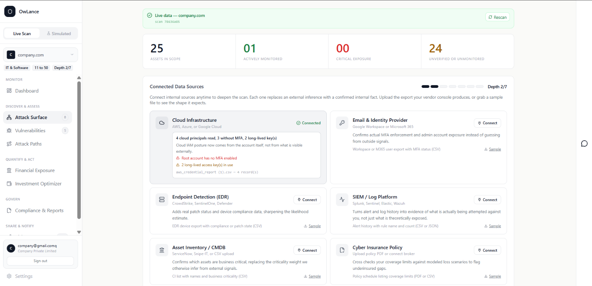
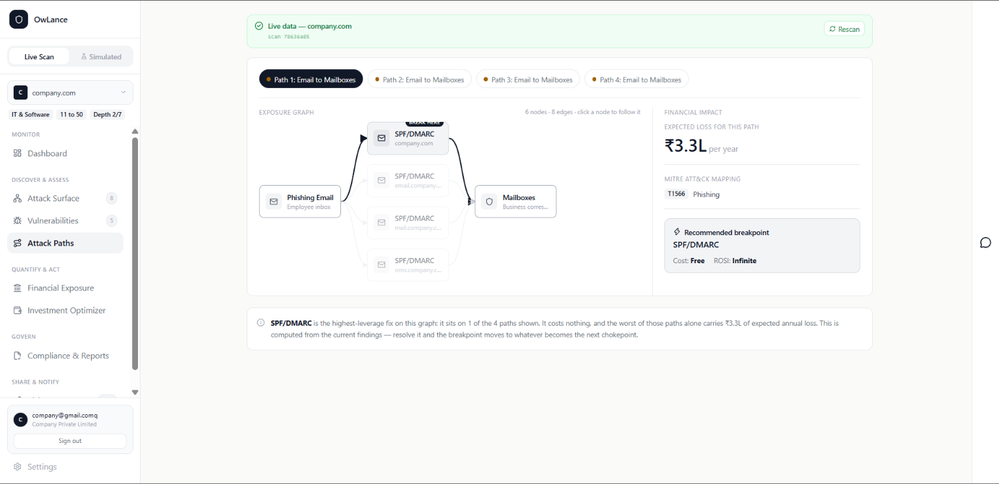
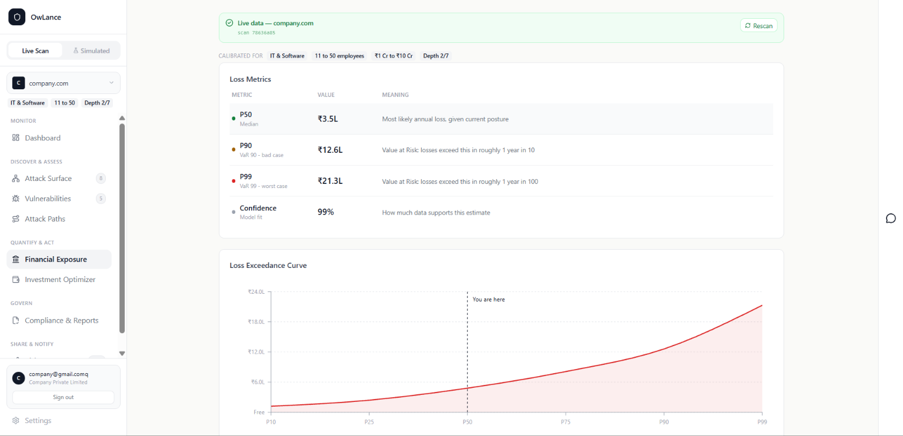
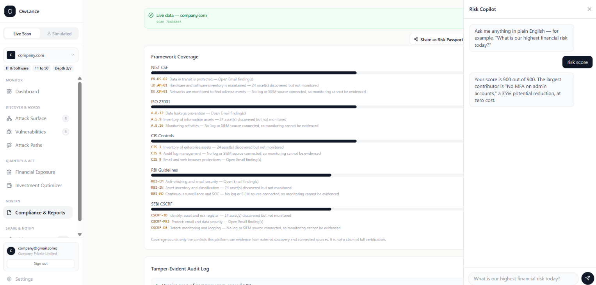

# RiskLens — Full Walkthrough

← [Back to README](../README.md)

A step-by-step run-through of the live product, screen by screen, from
entering a domain to a shareable proof of security posture. Every screen
below is reachable from the left-hand nav once a scan has run: **Monitor →
Discover & Assess → Quantify & Act → Govern → Share & Notify.**

---

## 1. Tell us about the business

Pick an **Industry**, **Employees** band, and **Annual Revenue** band, then
hit **Continue**. Nothing here is decorative — this calibrates every loss
estimate on the dashboard to the business's actual size and sector instead
of a generic average.

## 2. Connect data sources (optional)

Click **Continue** to skip this — passive discovery works with nothing
connected. Each source added — Cloud, Identity Provider, EDR, SIEM — fills
the risk graph with real internal data instead of an external inference, and
visibly raises the **Depth** meter shown at the top of every later screen.

## 3. Confirm scope and consent

**Passive discovery** (certificate logs, DNS, public breach data) is always
on and needs no permission — it only reads public records. To also run
**Active checks** (controlled port/config probes), toggle them on, then tick
*"I confirm I am authorized to assess this domain..."*. Click **Run Scan**.
Every action here is written to a tamper-evident audit log, visible later
under **Compliance & Reports**.

## 4. Live scan in progress

Real-time status reflects exactly what's running — subdomain discovery via
CT logs, CVE/EPSS/KEV cross-referencing, MFA status from any connected
identity provider — calibrated for the declared sector. Nothing here claims
to have happened if it didn't.

## 5. Dashboard

Lands here once the scan completes. One score (0–900, credit-score scale),
Expected Annual Loss, potential savings, and assets monitored — all computed
from the live scan, labeled **Live data — [domain]** at the top so it's
never confused with simulated data. **Security Posture** and **Score
Build-up** show exactly which categories (Identity, Network, Web App, Cloud,
Email) are driving the number.

## 6. Attack Surface

Click **Attack Surface** in the sidebar. Shows assets in scope, how many are
actively monitored vs. unverified, and the **Connected Data Sources** grid —
Cloud Infrastructure, Email & Identity Provider, Endpoint Detection, SIEM,
Asset Inventory, Cyber Insurance Policy. Click **Connect** on any card to
upload a real export (or **Sample** to see the expected file shape first);
each connection moves the **Depth** counter up and replaces an inferred
number with a confirmed internal fact — for example, "4 cloud principals
read, 3 without MFA" only appears once Cloud Infrastructure is connected.

## 7. Vulnerabilities

Click **Vulnerabilities**. Every finding is plotted on an Impact × Likelihood
**Risk Matrix**, with EPSS driving the likelihood axis. Click any cell to
filter; the findings table on the right shows CVSS, EPSS, status, and
remediation cost per finding — free fixes are labeled as such up front.

## 8. Attack Paths

Click **Attack Paths**. Each tab across the top (*Path 1, Path 2...*) is a
distinct route an attacker could take, rendered as a live **Exposure
Graph** — e.g. Phishing Email → SPF/DMARC → Mailboxes. The right-hand panel
shows the **Financial Impact** of that specific path, its **MITRE ATT&CK**
mapping (e.g. T1566 Phishing), and a **Recommended breakpoint** — the single
control that would break the most paths at once, with its cost and ROSI
called out (free fixes often show **Infinite** ROSI).

*Note: a "Simulated" toggle at the top switches to a denser demo dataset to
show how the same graph looks once Identity and Control Gap data sources are
connected — this platform never blends real and simulated data without
labeling which is which.*

## 9. Financial Exposure

Click **Financial Exposure**. This is where the "never a single fake-precise
number" claim is proven: **Loss Metrics** shows P50 (median, most likely
annual loss), P90 and P99 (Value at Risk — losses exceed this roughly 1 year
in 10, and 1 in 100), plus a **Confidence** score for how much data supports
the estimate. The **Loss Exceedance Curve** below plots the same numbers as
a curve, with "You are here" marking the business's current P50.

## 10. Investment Optimizer

Click **Investment Optimizer**. Drag the **Budget** slider and a
greedy-ratio knapsack algorithm live-recalculates the **Recommended
Actions** list — always surfacing free fixes first. Each action shows its
score impact, **Annual Savings**, **Total Spend**, and **ROSI**. Tick any
combination under *"What if we fixed these?"* to preview the effect before
committing to it — nothing is saved or rescanned until you act on it.

## 11. Compliance & Reports — and the Risk Copilot

Click **Compliance & Reports** under Govern. **Framework Coverage** maps
findings straight onto the controls a business actually gets audited
against — NIST CSF, ISO 27001, CIS Controls, RBI Guidelines, and SEBI
CSCRF — each with a coverage bar and the specific control codes it can or
can't evidence yet (e.g. *"DE.CM-01 — Networks are monitored to find adverse
events — No log or SIEM source connected, so monitoring cannot be
evidenced"*). The platform is explicit about its limits here: *"Coverage
counts only the controls this platform can evidence from external discovery
and connected sources. It is not a claim of full certification."* Scroll
down for the **Tamper-Evident Audit Log** — the record every consent and
scan action was written to back in Step 3.

This screen also shows **Risk Copilot**, open on the right — click the chat
icon on any screen to bring it up. It's built for the person who isn't going
to read a risk matrix: type a plain-English question like *"What is our
highest financial risk today?"* and get a direct answer pulled from the
already-computed scan data (*"Your score is 900 out of 900. The largest
contributor is 'No MFA on admin accounts,' a 35% potential reduction, at
zero cost."*). It's deliberately scoped to only **explain** numbers the
deterministic engine already computed — it never generates a score or
invents a finding, which is the same "AI explains, AI never scores"
principle behind the rest of the platform, just made accessible to
non-technical staff who'd otherwise need someone else to translate the
dashboard for them.

## 12. Risk Passport

Click **Risk Passport** under Share & Notify. A shareable, verifiable proof
of security posture — for a bank, insurer, or client — without exposing
what's still open. Click **Send full status to WhatsApp** to push it
directly to the owner's phone, **Copy shareable link** or **Download as
PDF** to hand it to a third party, or **Open public preview** to see exactly
what a recipient sees. The passport shows the score, an **Insurance ready**
percentage, and a QR code recipients can scan to independently **Verify
authenticity** against the tamper-evident hash-chain — it intentionally
never lists specific vulnerabilities or open ports.

## 13. API Documentation

Every number on the dashboard traces back to a real, testable endpoint —
consent logging, passive discovery + composite scoring, and the budget
optimizer are all live and independently verifiable via the interactive
Swagger UI at `/docs`.

---

← [Back to README](../README.md)
